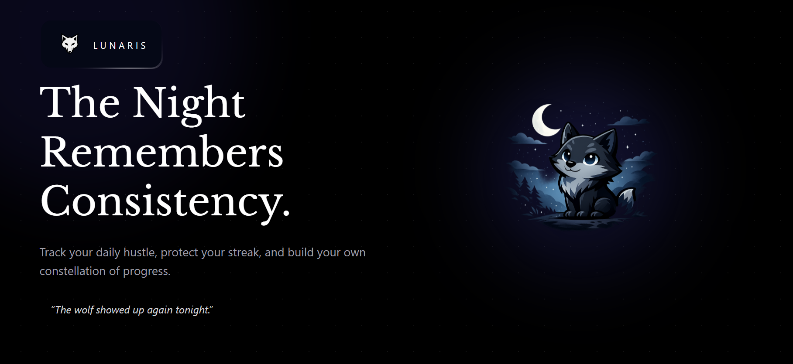
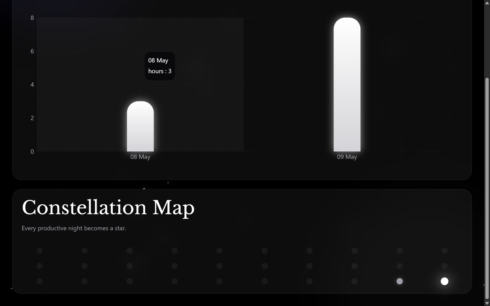
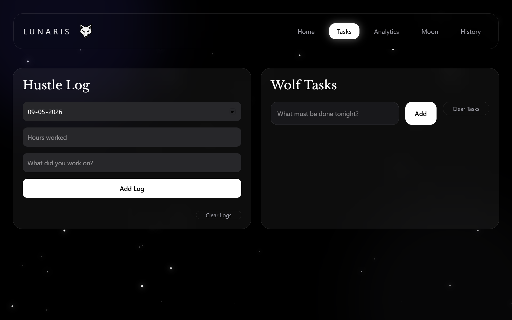
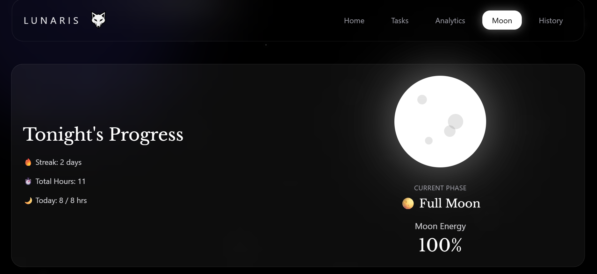
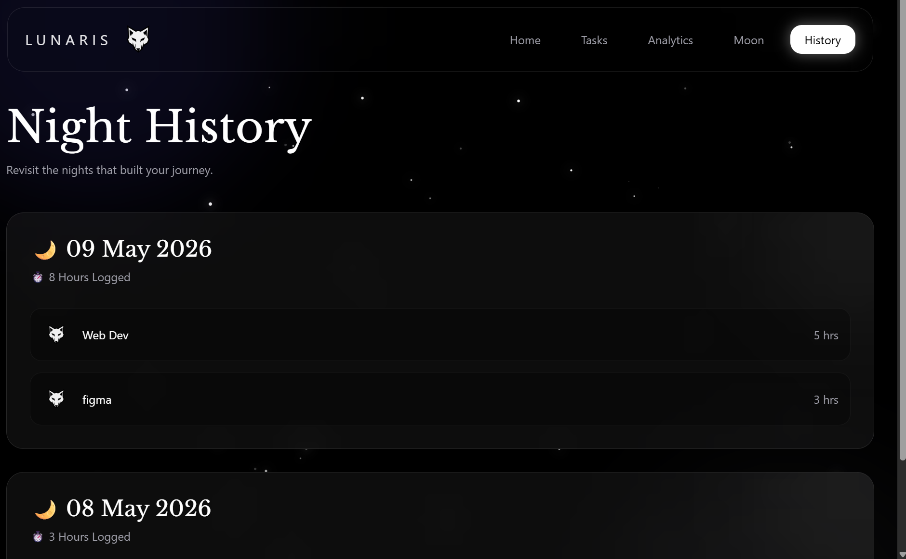
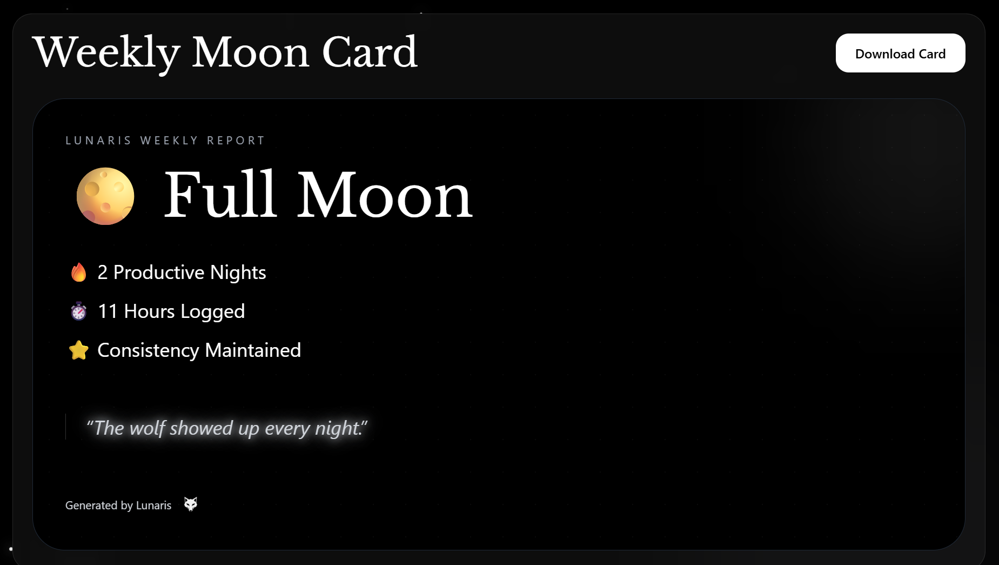

# 🌙 Lunaris



> A cinematic night-themed productivity desktop experience built with React.js.

Lunaris transforms consistency tracking into an immersive visual journey using moon phases, constellation heatmaps, glowing analytics, and a wolf-inspired aesthetic.

Instead of feeling like a traditional productivity dashboard, Lunaris is designed to feel calm, atmospheric, and emotionally engaging — built for people who quietly show up every night and keep building.

---

# ✨ Features

* 🌙 Dynamic Moon Phases
* ⭐ Constellation Heatmap
* 📊 Cinematic Productivity Analytics
* 🐺 Wolf Companion Aesthetic
* 📜 Night History Archive
* 📸 Downloadable Weekly Moon Cards
* ✨ Animated Night Sky
* 🔥 Streak Tracking System
* 🧭 Multi-page Desktop-style Navigation
* 📝 Daily Logging & Task Management

---

# 🖼 Screenshots

## 🏠 Home


---

## 📊 Analytics



---

## 📝 Tasks



---

## 🌕 Tonight's Progress



---

## 📜 History Archive



---

## 📸 Weekly Moon Card



---

# 🛠 Tech Stack

## Frontend

* React.js
* Vite
* Tailwind CSS
* React Router DOM
* Zustand
* Recharts
* Day.js
* html2canvas

---

# 🌌 Core Systems

## 🌙 Dynamic Moon System

The moon evolves dynamically based on daily productivity progress.

* 🌑 New Moon
* 🌒 Crescent Moon
* 🌓 Half Moon
* 🌔 Gibbous Moon
* 🌕 Full Moon

The more productive the night, the brighter the moon becomes.

---

## ⭐ Constellation Heatmap

Every productive night becomes a glowing star.

More productive days create brighter constellations, visually representing consistency over time.

---

## 📊 Progress Pillars

A cinematic analytics system built using Recharts with glowing productivity bars and moon-inspired visual styling.

---

## 📜 Night History

Lunaris stores day-wise productivity logs and tasks, allowing users to revisit their journey like a personal night journal.

---

## 📸 Weekly Moon Cards

Generate downloadable cinematic weekly summary cards to document progress visually.

---

# 📂 Project Structure

```txt
src/
 ├── assets/
 ├── components/
 ├── pages/
 ├── store/
 ├── utils/
```

---

#  Installation

```bash
# Clone repository
 git clone <your-repo-url>

# Move into project
 cd lunaris

# Install dependencies
 npm install

# Run development server
 npm run dev
```

---

#  Philosophy

Lunaris is built around one idea:

> Consistency over motivation.

The goal was not to create another corporate productivity dashboard, but a calm and immersive environment that makes nightly discipline feel rewarding.

---

#  Future Plans

* 🎵 Ambient focus music
* 🖥 Full desktop app experience
* ☁️ Cloud sync
* 🏆 Achievement system
* 🌌 Enhanced constellation interactions
* 🐺 Advanced wolf companion interactions
* 📅 Lunar calendar system

---

#  Built By

OM SINGH

Built with late nights, consistency, and curiosity.

If you liked the project, feel free to star the repository 🌙
